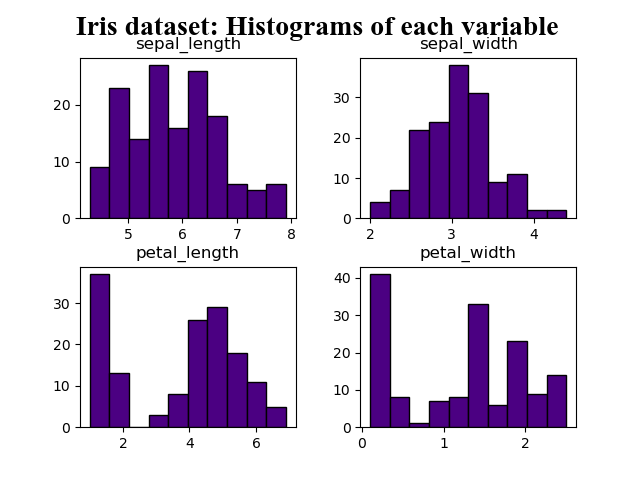
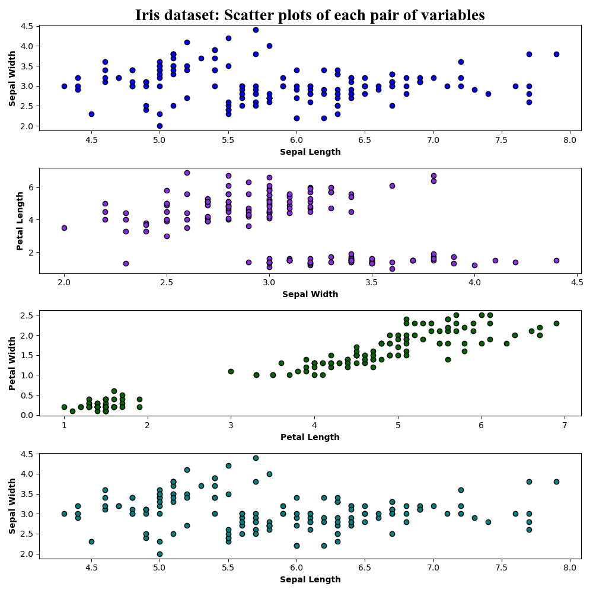
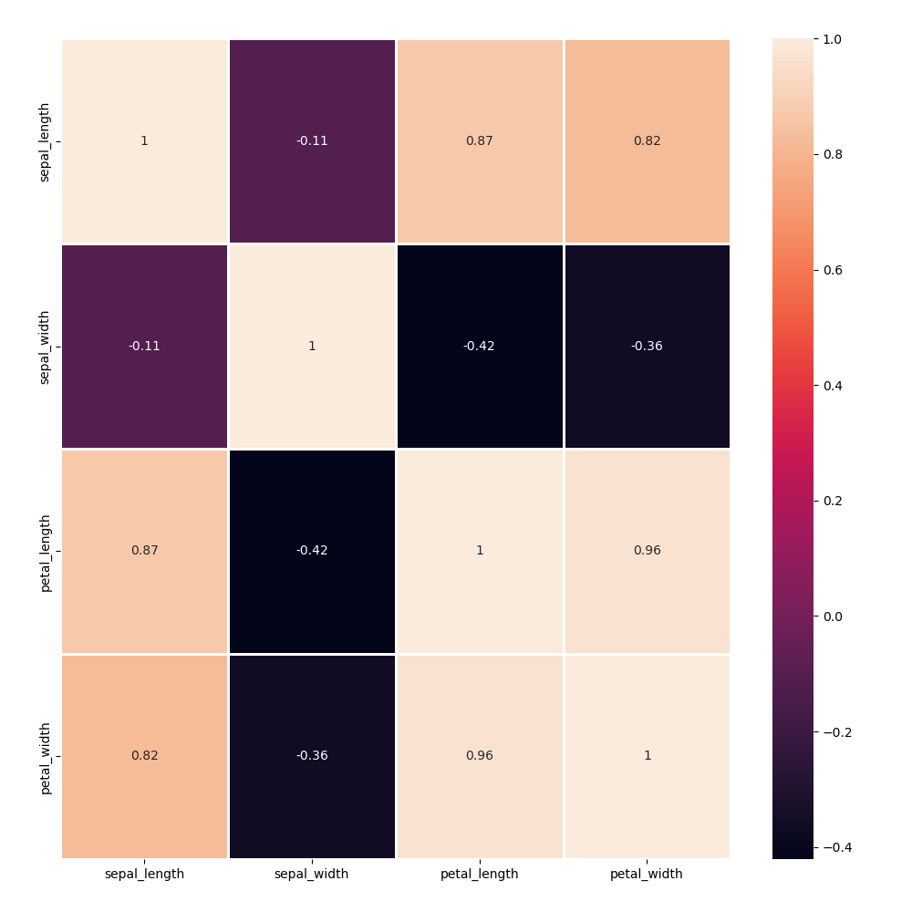
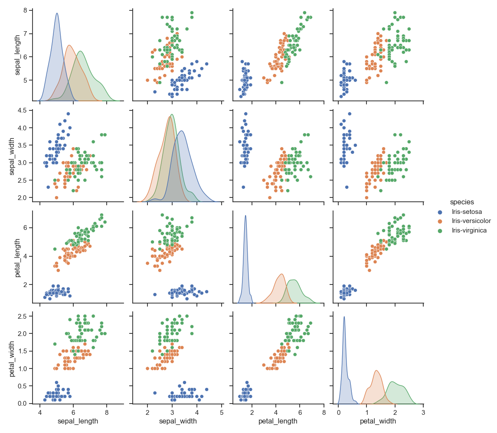
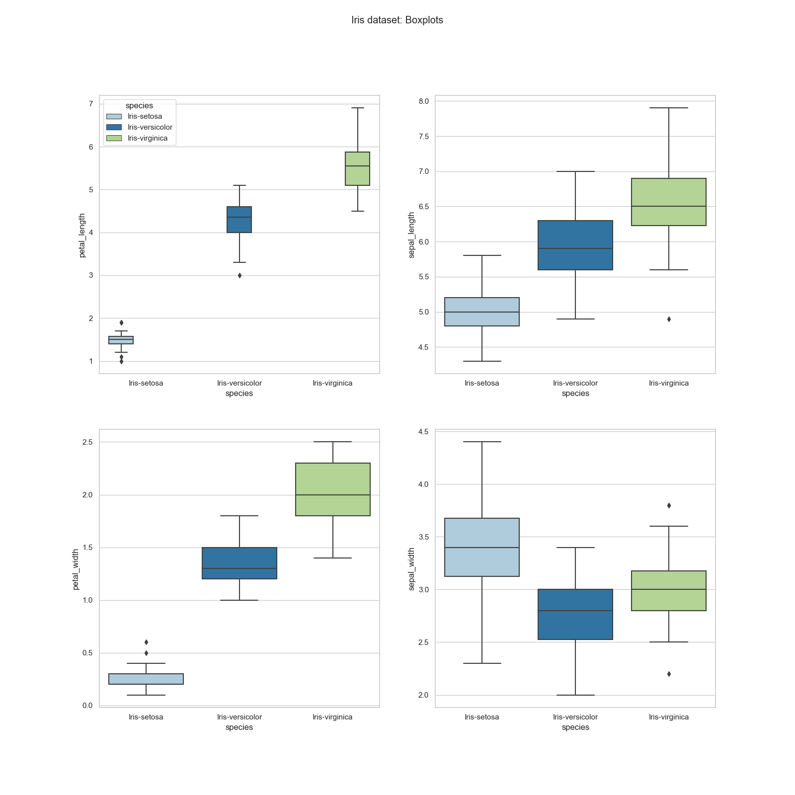

# pands-project

## Table of Contents
* [Background](https://github.com/ESutton567/pands-project/blob/main/README.md#background)
* [Fisher's Iris data set](https://github.com/ESutton567/pands-project/blob/main/README.md#fishers-iris-data-set)
* [Set-up](https://github.com/ESutton567/pands-project/blob/main/README.md#set-up)
* [Task 1: Output a summary of each variable to a single text file](https://github.com/ESutton567/pands-project/blob/main/README.md#task-1-output-a-summary-of-each-variable-to-a-single-text-file)
* [Task 2: Save a histogram of each variable to png files](https://github.com/ESutton567/pands-project/blob/main/README.md#task-3-output-a-scatter-plot-of-each-pair-of-variables-to-a-png-file)
* [Task 3: Output a scatter plot of each pair of variables (to a png file)](https://github.com/ESutton567/pands-problem-sheet#5-data)
* [Additional plot 1: Heatmap](https://github.com/ESutton567/pands-project/blob/main/README.md#additional-plot-1-heatmap)
* [Additional plot 2: Pairplots](https://github.com/ESutton567/pands-project/blob/main/README.md#additional-plot-2-pairplots)
* [Additional plot 3: Boxplots](https://github.com/ESutton567/pands-project/blob/main/README.md#additional-plot-3-boxplots)
* [Summary](https://github.com/ESutton567/pands-project/blob/main/README.md#summary)

## Background

This ReadMe file is an accompaniment to a project I completed as part of my Higher Diploma in in Computing in Data Analytics

The overall aim of this task is to research the well-known [Fisher's Iris data set](https://en.wikipedia.org/wiki/Iris_flower_data_set).

The information in this ReadMe file covers the work necessary to meet the individual objectives set within this task and includes the following steps: 
* Research the data set online and provide a summary
* Add the data set to the repository
* Write a program called analysis.py that:
  * Task 1: Outputs a summary of each variable to a single text file
  * Task 2: Saves a histogram of each variable to png files
  * Task 3: Outputs a scatter plot of each pair of variables
  * Additional tasks: Perform any other appropriate analysis


## Fisher's Iris data set

This data set is a well-known benchmark multivariate data set used for testing out and validating programs <sup>1,2</sup>. It was developed by Ronald Fisher, a statistician and biologist<sup>3</sup>, whose staunch support of eugenics will forever overshadow any contributions he made to his field<sup>4,5</sup>. Fisher developed the data set in 1936 as an example of a linear discriminant analysis<sup>6</sup>.

Nowadays the data set is commonly used as a test case in machine learning techniques<sup>7</sup>. The data set itself contains 50 instances each of 3 classes (types) of iris plant<sup>8</sup> for a total of 150 instances and can be found [here](https://archive.ics.uci.edu/ml/datasets/iris). 

The information in the data set is laid out as follows:

| Sepal length (cm)  | Sepal Width (cm)    | Petal Length (cm)  | Petal Width (cm)  | Species (cm)  |
|:---------------|:---------------|:--------------|:--------------|----------:|
| 50 data points | 50 data points | 50 data points| 50 data points| setosa    |
| 50 data points | 50 data points | 50 data points| 50 data points| versicolor|
| 50 data points | 50 data points | 50 data points| 50 data points| virginica |

To begin the analysis of this data set we will look at some descriptive summaries, followed by employing the use of the [**Pandas**](https://pandas.pydata.org/) software to manipulate the data, allowing visualisation of the data through [**Matplotlib**](https://matplotlib.org/). The latter half of the analysis will be an exploration into the data visualisation capabilities of [**Seaborn**](https://seaborn.pydata.org/), a 'Python data visualisation library based on Matplotlib'.

### Set-up

Before we begin writing code for the analyses that we would like to explore we need to set-up our environment: 

1. Suggested tools to download/sign-up to run this program:
* [Visual Studio Code (VSC)](https://code.visualstudio.com/) 
* [Python 3.8 or higher](https://www.python.org/)
* [GitHub website](https://github.com/)

2. Create the program: 
* In this project the file is named [analysis.py](https://github.com/ESutton567/pands-project/blob/main/analysis.py)

3. Import the required modules:
~~~
import pandas as pd
import re
import csv
import matplotlib.pyplot as plt
import seaborn as sns
~~~

4. Download the Iris data set [here](https://archive.ics.uci.edu/ml/datasets/iris) to the same folder you will save your analysis program, read it into the program, and assign the column names<sup>9</sup>:
~~~
path = '../pands-project/'
filename = path + 'iris_data.csv'
# assign column names
columns = ['sepal_length','sepal_width','petal_length','petal_width', 'species']
~~~

5. Read in the file and locate the target variable within the dataset<sup>10</sup>, i.e. in this case we want to compare between Species of Iris plants (Setosa, Virginia and Versicolor)
~~~
#read in file
iris_data = pd.read_csv(filename, sep= ',', header=None, names=columns)

# locate the target data within the dataset
setosa = iris_data.loc[iris_data['species']=='Iris-setosa']
virginica = iris_data.loc[iris_data['species']=='Iris-virginica']
versicolor = iris_data.loc[iris_data['species']=='Iris-versicolor']
~~~

6. Proceed with the code for the analyses 

### Task 1: Output a summary of each variable to a single text file

* Using the ```open``` command a text file is created and opened. The initial header is written to the file ('w') and subsequent outputs are appended ('a')<sup>11</sup> 
 * The ```describe``` command outputs a statistics summary for each variable (sepal length, sepal width, petal length and petal width) in the data set<sup>12,13</sup> 
 * The ```dtype``` command outputs the type of of the object, i.e. float, object, etc<sup>14</sup>
 * the ```info``` command output a concise summary of the data set<sup>15</sup>

~~~
# create a text file to output a summary of the variables
print('Summary statistics for each variable (cm) in the Iris Dataset:\n', file=open('irisVariablesSummary.txt', 'w'))
# append a stats summary of the variables
summary_all = iris_data.describe()
print(summary_all, file=open('irisVariablesSummary.txt', 'a'))

print('\nA list of the type for each variable in the Iris Dataset:\n', file=open('irisVariablesSummary.txt', 'a'))
# append a type summary of the variables
print(iris_data.dtypes, file=open('irisVariablesSummary.txt', 'a'))

print('\nA concise summary of the Iris Dataset: \n', file=open('irisVariablesSummary.txt', 'a'))
print(iris_data.info, file=open('irisVariablesSummary.txt', 'a'))
~~~

### Task 2: Save a histogram of each variable to png files

* This program outputs a histogram of each variable and saves it ot a png file within the same folder
* First we instruct the program to output histograms, customising the colour and removing the gridlines<sup>16,17,18,19</sup>
~~~
iris_data.hist(color='indigo', edgecolor='black', grid=False)
~~~

* Then we add a custom title to the plot/figure<sup>19</sup>
~~~
plt.text(-3.5, 105,'Iris dataset: Histograms of each variable', 
                fontname='Times New Roman',
                fontsize=20, 
                fontweight='bold'
                )
~~~

* Finally, we output the plot to a png file
~~~
plt.savefig("iris_data_Histogram.png")
~~~

* The resulting image will be saved: 


We can see that sepal length and width follow a normal distribution whereas petal length and width do not


### Task 3: Output a scatter plot of each pair of variables (to a png file)

* This program outputs a scatter plot of each pair of variables (and saves it to a png file within the same folder)
* First we customise the figure to contain 4 subplots (1 for each variable) and define the size<sup>20,21,22</sup>
~~~
fig,ax = plt.subplots(4, figsize=(10,10))
~~~

* Next we instruct the program to output the first plot: customised for colours and with axis labels set<sup>23,24,25</sup> 
* We also add the figure title at this point<sup>26</sup> 

~~~
ax[0].scatter(x = iris_data['sepal_length'], y = iris_data['sepal_width'], color = 'blue', edgecolors = "black")
ax[0].set_xlabel("Sepal Length", weight='bold')
ax[0].set_ylabel("Sepal Width", weight='bold')
ax[0].set_title('Iris dataset: Scatter plots of each pair of variables', 
                fontname='Times New Roman',
                fontsize=20, 
                fontweight='bold', 
                )

~~~

* Next we output the remaining scatterplots within the same figure

~~~ 
ax[1].scatter(x = iris_data['sepal_width'], y = iris_data['petal_length'], color = 'blueviolet', edgecolors = "black")
ax[1].set_xlabel("Sepal Width", weight='bold')
ax[1].set_ylabel("Petal Length", weight='bold')

ax[2].scatter(x = iris_data['petal_length'], y = iris_data['petal_width'], color = 'darkgreen', edgecolors = "black")
ax[2].set_xlabel("Petal Length", weight='bold')
ax[2].set_ylabel("Petal Width", weight='bold')

ax[3].scatter(x = iris_data['sepal_length'], y = iris_data['sepal_width'], color = 'teal', edgecolors = "black")
ax[3].set_xlabel("Sepal Length", weight='bold')
ax[3].set_ylabel("Sepal Width", weight='bold')
~~~

* Apply a tight layout to automatically adjust the subplots to fit in the figure area<sup>27</sup> 
~~~
plt.tight_layout()
~~~

* Save the figure to a png file, and close it to prevent future figures/plots being saved to the same file<sup>28</sup> 
~~~
plt.savefig("iris_data_Scatterplot.png")
# need to close the above figure to prevent plots overlapping in the same file
plt.clf()
~~~

* The resulting image will be saved: 




### Additional plot 1: Heatmap

* This program runs a heatmap of the iris data set using the Seaborn software 
* It shows correlations between all the numerical values of the variables
* The output, like most plots, can be customised, and in this case each cell is also annotated with the numeric value<sup>29,30</sup> 

~~~
sns.heatmap(iris_data.corr(), linecolor = 'white', linewidths = 1, annot = True)
plt.savefig("iris_data_Heatmap.png")
~~~

* The resulting image will be saved: 




### Additional plot 2: Pairplots

* This program runs a pairs plot of the iris data set using the Seaborn software
* They are usually run to identify trends in the data that might require a follow-up analysis
* The plot output for this one is coloured using the command ```hue``` which assigns a different colour to each of the named species<sup>29,31</sup> 

~~~
sns.set(style='ticks', color_codes=True)
g = sns.pairplot(iris_data, hue='species')

plt.savefig("iris_data_Pairplot.png")
~~~

* The resulting image will be saved: 


It's quite clear from these plots that the variables we are looking at in this analysis are much different in the Setosa species than the Versicolour and Virginica species, who tend to group together

### Additional plot 3: Boxplots

* This program outputs boxplots of the variables in the iris data set using the Seaborn software
* Boxplots are a standardised by of displaying distribution values that consist of the minimum and maximum, first and 3rd quartiles and the median 
* First we set the style, followed by directing the output to a 2 x 2 plot figure, and customising the size<sup>32,33,34</sup> 
~~~
sns.set(style="whitegrid", palette="Paired")
f, axes = plt.subplots(2, 2, figsize=(16, 16)) 
~~~

* Next we add in the attributes of each plot and orientate then to the 2D grid figure<sup>32,33,34</sup>, add a title and output to a png file

~~~
sns.boxplot(x='species', y='petal_length',hue = 'species',data=iris_data, ax=axes[0,0])
sns.boxplot(x='species', y='sepal_length', data=iris_data, ax=axes[0,1])
sns.boxplot(x='species', y='petal_width',data=iris_data, ax=axes[1,0])
sns.boxplot(x='species', y='sepal_width', data=iris_data, ax=axes[1,1])

plt.suptitle('Iris dataset: Boxplots')
plt.savefig("iris_data_Boxplot.png")
~~~

* The resulting image will be saved: 




### Summary

Overall, the Iris data set is a great starter data set for data visualisation beginners. It is readily available, the data is clean, and it contains no missing datapoints, i.e. it doesn't require much manipulation to begin writing code for analysis. 

The plots explored in this analysis are only a fraction of what can be achieved using the tools employed; Pandas, Matplotlib, and the very easy to use, Seaborn software. Others have explored the data set using violin plots, factor plots, joint plots, and there also countless ways to customise the output for the variables you want to look at individually, or jointly - allowing you to play the music, instead of just showing the notes.

**References**
1. Yen GG, Meesad P. Constructing a fuzzy rule-based system using the ILFN network and Genetic Algorithm. Int J Neural Syst. 2001 Oct;11(5):427-43. doi: 10.1142/S0129065701000618. PMID: 11709810.
2. Woods RP, Hansen LK, Strother S. How many separable sources? Model selection in independent components analysis. PLoS One. 2015 Mar 26;10(3):e0118877. doi: 10.1371/journal.pone.0118877. PMID: 25811988; PMCID: PMC4374758.
3. https://en.wikipedia.org/wiki/Ronald_Fisher
4. Blacker, C.P. (1931). "The sterilization proposals: A history of their development". Eugen Rev. 22 (4): 240. PMC 2984995. PMID 21259955. "Amemorandum was accordingly circulated to the Council signed by Dr. R.A. Fisher, Professor Huxley, Dr. J.A. Ryle, Mr. E.J. Lidbetter, and myself, asking for authorization to form a sub-committee, the aim of which would be to secure the legalization of eugenics sterilization. The memorandum was unanimously approved by the Council, and in this way the nucleus of the existing Committee for Legalizing Eugenic Sterilization was formed."
5. "Report of Committee for Legalizing Eugenic Sterilization". Postgraduate Medical Journal. 6 (61): 13. 1930. doi:10.1136/pgmj.6.61.13. PMC 2531824.
6. FISHER, R.A. (1936), THE USE OF MULTIPLE MEASUREMENTS IN TAXONOMIC PROBLEMS. Annals of Eugenics, 7: 179-188. https://doi.org/10.1111/j.1469-1809.1936.tb02137.x
7. "UCI Machine Learning Repository: Iris Data Set". archive.ics.uci.edu. Retrieved 2017-12-01.
8. https://archive.ics.uci.edu/ml/datasets/iris
9. https://gist.github.com/curran/a08a1080b88344b0c8a7
10. https://www.adamsmith.haus/python/answers/how-to-set-column-names-when-importing-a-csv-into-a-pandas-dataframe-in-python
11. https://www.w3schools.com/python/python_file_write.asp
12. https://stackoverflow.com/questions/33889310/r-summary-equivalent-in-numpy
13. https://www.geeksforgeeks.org/python-pandas-dataframe-describe-method/
14. https://numpy.org/doc/stable/reference/arrays.dtypes.html
15. https://www.geeksforgeeks.org/python-pandas-dataframe-info/
16. https://matplotlib.org/3.5.0/api/_as_gen/matplotlib.pyplot.hist.html
17. https://rpubs.com/Sora/developing-data-product
18. https://rajritvikblog.wordpress.com/2017/06/29/iris-dataset-analysis-python/
19. https://datagy.io/histogram-python/
20. https://stackoverflow.com/questions/39712767/how-to-set-size-for-scatter-plot
21. https://www.futurelearn.com/info/courses/data-visualisation-with-python-matplotlib-and-visual-analysis/0/steps/192897
22. https://stackabuse.com/matplotlib-scatterplot-tutorial-and-examples/
23. https://matplotlib.org/3.5.0/api/_as_gen/matplotlib.pyplot.scatter.html
24. https://matplotlib.org/stable/gallery/color/named_colors.html
25. https://matplotlib.org/stable/api/font_manager_api.html#matplotlib.font_manager.FontProperties
26. https://matplotlib.org/3.1.1/gallery/subplots_axes_and_figures/figure_title.html
27. https://matplotlib.org/3.5.0/api/_as_gen/matplotlib.pyplot.tight_layout.html
28. https://stackoverflow.com/questions/36018681/stop-seaborn-plotting-multiple-figures-on-top-of-one-another
29. https://www.geeksforgeeks.org/python-basics-of-pandas-using-iris-dataset/
30. https://towardsdatascience.com/all-the-ways-you-can-customize-your-charts-and-graphs-in-seaborn-9be90fa6f5b5
31. https://web.ics.purdue.edu/~yrosokha/code/Seaborn_Example_1.html
32. https://seaborn.pydata.org/generated/seaborn.boxplot.html
33. https://www.angela1c.com/projects/iris_project/investigating-the-iris-dataset/
34. https://stackabuse.com/seaborn-box-plot-tutorial-and-examples/
35. https://matplotlib.org/stable/gallery/subplots_axes_and_figures/subplots_demo.html


